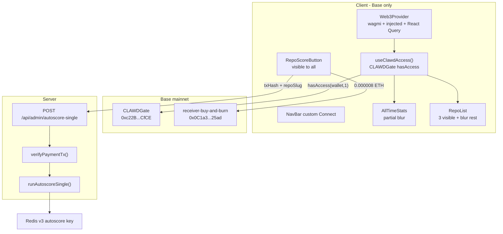

# Wallet connect, CLAWD gate, and per-repo Score/Rescore

## Confirmed requirements (user-reviewed)

- **Score/Rescore button:** visible on every repo card for everyone; only functional when wallet connected + CLAWDGate `hasAccess(wallet, 1) === true`. Not connected → click prompts connect. Connected but no access → inline "Hold 10M $CLAWD to use this feature."
- **No admin bypass** — one rule for everyone on blur gate and Score/Rescore.
- **Payment:** exactly `0.000008 ETH` to `0x0C1a3DB07304D2E4E551AB4A7b083382a33f25ad` (receiver-buy-and-burn). One tx → one confirmation → autoscore single repo. 100% burned as CLAWD via contract.
- **Blur gate** (when not connected OR `hasAccess` false):
  - Activity snapshot: **Total Repos** + **Commits (30d)** visible; blur Commits 7d, Active Days 30d, Active Days 7d, Last Commit
  - Grades: all 4 visible (overall in header + 3 axis cards) — **no blur**
  - Repo list: top 3 visible; rest blurred with CTA overlay
  - CTA text: **"Connect wallet — hold 10M $CLAWD to unlock the full report"**
- **Chain:** Base mainnet only (`chainId: 8453`). Not Ethereum mainnet.
- **ETH cost copy:** short version in Score button tooltip; full explanation on About page. Fixed ETH amount; USD equivalent fluctuates (~$0.02 at time of writing, Jul 2026).

---

## Architecture overview



**Unlock rule:** `isConnected && hasAccess === true` where `hasAccess` comes from CLAWDGate tier `1` (10M+ CLAWD). **No admin bypass.**

---

## 1. New dependencies

Add to [`package.json`](package.json):

| Package | Version | Purpose |
|---------|---------|---------|
| `wagmi` | `^2.12.0` | Account, readContract, sendTransaction, connect |
| `viem` | (peer) | Base chain, server tx verification |
| `@tanstack/react-query` | (peer) | Required by wagmi v2 |

**No RainbowKit.** Custom connect button via `injected()` connector + `useConnect` / `useDisconnect`.

No WalletConnect project ID required for v1 (browser extension wallets only via `injected()`).

---

## 2. Web3 config — reference pattern

### New: [`lib/wagmi/config.ts`](lib/wagmi/config.ts)

Use this exact pattern (proven working setup):

```ts
"use client"
import { createConfig, http } from "wagmi"
import { base } from "wagmi/chains"
import { injected } from "wagmi/connectors"

export const wagmiConfig = createConfig({
  chains: [base],
  connectors: [injected()],
  transports: { [base.id]: http() },
})
```

### New: [`components/wallet/Web3Provider.tsx`](components/wallet/Web3Provider.tsx)

```tsx
"use client"
import { WagmiProvider } from "wagmi"
import { QueryClient, QueryClientProvider } from "@tanstack/react-query"
import { wagmiConfig } from "@/lib/wagmi/config"
import { ClawdAccessProvider } from "./ClawdAccessContext"

const queryClient = new QueryClient()

export default function Web3Provider({ children }: { children: React.ReactNode }) {
  return (
    <WagmiProvider config={wagmiConfig}>
      <QueryClientProvider client={queryClient}>
        <ClawdAccessProvider>{children}</ClawdAccessProvider>
      </QueryClientProvider>
    </WagmiProvider>
  )
}
```

### New: [`lib/web3/constants.ts`](lib/web3/constants.ts)

```ts
export const BASE_CHAIN_ID = 8453

// CLAWDGate — 10M+ CLAWD access check (tier 1)
export const CLAWD_GATE_ADDRESS = "0xc22B7b983EC81523c969753c2385106835E8CfCE"
export const CLAWD_GATE_TIER = 1

export const CLAWD_GATE_ABI = [{
  name: "hasAccess",
  type: "function",
  inputs: [
    { name: "wallet", type: "address" },
    { name: "tier", type: "uint8" },
  ],
  outputs: [{ type: "bool" }],
  stateMutability: "view",
}] as const

export const RECEIVER_BUY_AND_BURN = "0x0C1a3DB07304D2E4E551AB4A7b083382a33f25ad"
export const SCORE_PAYMENT_WEI = 8_000_000_000_000n // 0.000008 ETH
```

**Do not** use direct ERC-20 `balanceOf` on the CLAWD token for gating — use CLAWDGate only.

---

## 3. CLAWDGate access hook

### New: [`components/wallet/ClawdAccessContext.tsx`](components/wallet/ClawdAccessContext.tsx)

Reference implementation — use exactly:

```ts
const { address, isConnected } = useAccount()
const { data: hasAccessRaw, isLoading, refetch } = useReadContract({
  address: CLAWD_GATE_ADDRESS,
  abi: CLAWD_GATE_ABI,
  functionName: "hasAccess",
  args: address ? [address, CLAWD_GATE_TIER] : undefined,
  chainId: base.id,
  query: { enabled: !!address },
})
const hasAccess = !!hasAccessRaw
const unlocked = isConnected && hasAccess
```

Export `useClawdAccess()` with:

| Field | Meaning |
|-------|---------|
| `isConnected` | Wallet connected |
| `address` | Connected address |
| `hasAccess` | CLAWDGate tier-1 result |
| `unlocked` | Full report unlocked |
| `isLoading` | Gate check pending |
| `connect()` | Trigger wallet connect (wraps `useConnect`) |
| `disconnect()` | Wraps `useDisconnect` |
| `refetchAccess()` | Refetch after connect/disconnect |

---

## 4. Nav and custom connect button

### New: [`components/NavBar.tsx`](components/NavBar.tsx)

Extract nav from [`app/layout.tsx`](app/layout.tsx).

### New: [`components/wallet/ConnectWalletButton.tsx`](components/wallet/ConnectWalletButton.tsx)

- **No RainbowKit** — `useConnect({ connector: injected() })` + `useDisconnect()`
- Styled to match dark theme: 13px, pill border (`var(--border)` / `var(--accent-border)`), accent when connected
- Disconnected: "Connect wallet"
- Connected: truncated address; click opens small disconnect option or toggles disconnect
- Prompt user to switch to Base if wrong chain (`useChainId()` !== 8453) — show "Switch to Base" using `useSwitchChain`

### Change: [`app/layout.tsx`](app/layout.tsx)

Wrap body in `<Web3Provider>`, replace inline nav with `<NavBar />`.

No RainbowKit CSS imports needed.

---

## 5. Blur gate UI

### New: [`components/wallet/GateBlur.tsx`](components/wallet/GateBlur.tsx)

When `!unlocked`: `filter: blur(6px)`, `opacity: ~0.35`, `pointer-events: none` on children.

### New: [`components/wallet/GateOverlay.tsx`](components/wallet/GateOverlay.tsx)

CTA (exact): **"Connect wallet — hold 10M $CLAWD to unlock the full report"**

- Not connected: click → `connect()`
- Connected, no access: same text, informational only
- Placed on **blurred repo section only** (not activity snapshot)

### Change: [`components/AllTimeStats.tsx`](components/AllTimeStats.tsx)

Use `useClawdAccess()`. When locked, blur cards at indices 2–5 only:

| Index | Label | Locked state |
|-------|-------|--------------|
| 0 | Total repos | Visible |
| 1 | Commits (30d) | Visible |
| 2 | Commits (7d) | Blurred |
| 3 | Active days (30d) | Blurred |
| 4 | Active days (7d) | Blurred |
| 5 | Last commit | Blurred |

### Change: [`components/RepoList.tsx`](components/RepoList.tsx)

- Local `repos` state from props (post-rescore updates)
- First 3 filtered/sorted repos: always visible
- Repos 4+: `GateBlur` wrapper + `GateOverlay`
- **GradesPanel untouched** — no blur on grades

---

## 6. Score/Rescore button

### New: [`lib/scoringStatus.ts`](lib/scoringStatus.ts)

```ts
export function getScoringStatus(repo: Repo): 'unscored' | 'scored' {
  return isUnscoredRecent(repo) ? 'unscored' : 'scored'
}
```

No change to [`lib/scores.ts`](lib/scores.ts) `Repo` type.

### New: [`components/RepoScoreButton.tsx`](components/RepoScoreButton.tsx)

**Always rendered** on every repo card (including blurred ones) — visible to all visitors.

| State | Behavior |
|-------|----------|
| Not connected | Button visible; click → `connect()` |
| Connected, `!hasAccess` | Button visible; click → inline "Hold 10M $CLAWD to use this feature" |
| Connected, `hasAccess` | Click → `sendTransaction({ to: RECEIVER_BUY_AND_BURN, value: SCORE_PAYMENT_WEI })` |
| Tx pending | Disabled, "Scoring…" |
| Tx confirmed | `POST /api/admin/autoscore-single` with `{ repoSlug, txHash, walletAddress }` |
| Success | `onScored(updatedRepo)` updates local RepoList state |
| Failure | Inline error on card |

Label: **Score** if unscored, **Rescore** if scored.

**Tooltip** (hover):

> Score this repo using Claude AI. Cost: 0.000008 ETH (~$0.02 at time of writing — ETH price fluctuates so actual USD cost may vary). Payment is burned as $CLAWD via the receiver-buy-and-burn contract, supporting the ecosystem. Result is cached — community benefits from your score.

**Hand-scored override:** After rescore, client local state replaces card data (server merge still prefers hand-scored `REPOS` on refresh). Aggregate grades unchanged until reload — acceptable.

---

## 7. autoscore-single API

### New: [`app/api/admin/autoscore-single/route.ts`](app/api/admin/autoscore-single/route.ts)

```
POST { repoSlug, txHash, walletAddress }
→ { ok: true, repo: Repo } | { ok: false, error: string }
```

- **No admin password** — verified ETH payment is auth
- `maxDuration = 60`
- Verify tx on Base via [`lib/web3/verifyPayment.ts`](lib/web3/verifyPayment.ts):
  - Receipt success
  - `from` === `walletAddress`
  - `to` === `RECEIVER_BUY_AND_BURN`
  - `value` === `SCORE_PAYMENT_WEI`
- Replay guard: Redis `build-report:paid-tx:{txHash}` (7d TTL, reject reuse)
- Call `runAutoscoreSingle(repoSlug)` → return `Repo`

### Extend: [`lib/autoscore.ts`](lib/autoscore.ts)

Add `runAutoscoreSingle(repoSlug)`:
1. Resolve GitHub metadata (`fetchRepoBySlug` in [`lib/github.ts`](lib/github.ts) or from cached stats)
2. `flushAutoScore(repoSlug)` — always re-infer on paid rescore
3. Existing private `inferScore()` — **no prompt/logic changes**
4. Write existing `build-report:autoscore:v3:{slug}` key
5. Return `Repo`

---

## 8. About page — Score & Rescore section

### Change: [`app/about/page.tsx`](app/about/page.tsx)

New section covering:

- What Score/Rescore does (Claude AI inference for one repo)
- **Cost:** 0.000008 ETH fixed; approximately **$0.02 at the time this was built (Jul 2026)** — ETH price fluctuates, so actual USD cost may be ~$0.01–$0.04 depending on when you use it
- **What happens to the ETH:** sent to receiver-buy-and-burn (`0x0C1a3DB07304D2E4E551AB4A7b083382a33f25ad`), which automatically buys and burns $CLAWD via Uniswap V3
- **Who can use it:** wallets passing CLAWDGate tier 1 (10M+ $CLAWD)
- **Result is shared:** cached in Redis; everyone sees it for free after one person pays

---

## 9. Files summary

### New files (12)

| File | Role |
|------|------|
| [`lib/wagmi/config.ts`](lib/wagmi/config.ts) | wagmi config, Base + injected only |
| [`lib/web3/constants.ts`](lib/web3/constants.ts) | CLAWDGate ABI, payment constants |
| [`lib/web3/verifyPayment.ts`](lib/web3/verifyPayment.ts) | Server-side tx verification |
| [`lib/scoringStatus.ts`](lib/scoringStatus.ts) | Score vs Rescore label helper |
| [`components/wallet/Web3Provider.tsx`](components/wallet/Web3Provider.tsx) | Provider stack |
| [`components/wallet/ClawdAccessContext.tsx`](components/wallet/ClawdAccessContext.tsx) | CLAWDGate hasAccess hook |
| [`components/wallet/ConnectWalletButton.tsx`](components/wallet/ConnectWalletButton.tsx) | Custom dark-theme connect |
| [`components/wallet/GateBlur.tsx`](components/wallet/GateBlur.tsx) | Blur wrapper |
| [`components/wallet/GateOverlay.tsx`](components/wallet/GateOverlay.tsx) | CTA overlay |
| [`components/NavBar.tsx`](components/NavBar.tsx) | Nav + wallet |
| [`components/RepoScoreButton.tsx`](components/RepoScoreButton.tsx) | Score/Rescore + tooltip |
| [`app/api/admin/autoscore-single/route.ts`](app/api/admin/autoscore-single/route.ts) | Paid single-repo autoscore |

### Modified files (7)

| File | Change |
|------|--------|
| [`package.json`](package.json) | wagmi, viem, react-query |
| [`app/layout.tsx`](app/layout.tsx) | Web3Provider + NavBar |
| [`components/AllTimeStats.tsx`](components/AllTimeStats.tsx) | Partial card blur |
| [`components/RepoList.tsx`](components/RepoList.tsx) | Gate blur, local state, Score button |
| [`lib/autoscore.ts`](lib/autoscore.ts) | `runAutoscoreSingle` |
| [`lib/github.ts`](lib/github.ts) | `fetchRepoBySlug` helper |
| [`app/about/page.tsx`](app/about/page.tsx) | Score & Rescore section |

### Explicitly NOT in scope

- RainbowKit or WalletConnect project ID
- Admin wallet bypass
- Direct ERC-20 balance check for gating
- Grade calculation changes
- Redis autoscore key schema changes (only additive `paid-tx:` replay keys)

---

## 10. Implementation order

1. Install deps + wagmi config + Web3Provider + custom connect in nav
2. CLAWDGate `hasAccess` hook — verify unlock in dev with known holder wallet
3. GateBlur/Overlay + AllTimeStats partial blur + RepoList top-3 blur
4. `runAutoscoreSingle` + `verifyPayment` + API route
5. RepoScoreButton (visible to all) + RepoList local state + tooltip
6. About page Score & Rescore section
7. Commit (user pushes)

---

## 11. Manual test checklist

- Connect via injected wallet on **Base only** (8453)
- Wrong chain → prompted to switch to Base
- Wallet without tier-1 access: partial activity blur, repos 4+ blurred, Score button shows hold message
- Wallet with tier-1 access: everything visible
- Score button **visible** even when blurred / not connected
- Not connected → click Score → connect prompt
- Score flow: pay 0.000008 ETH → confirm → card updates
- Rescore on hand-scored repo: client card updates
- Reused txHash rejected
- Tooltip + About page ETH cost copy present
